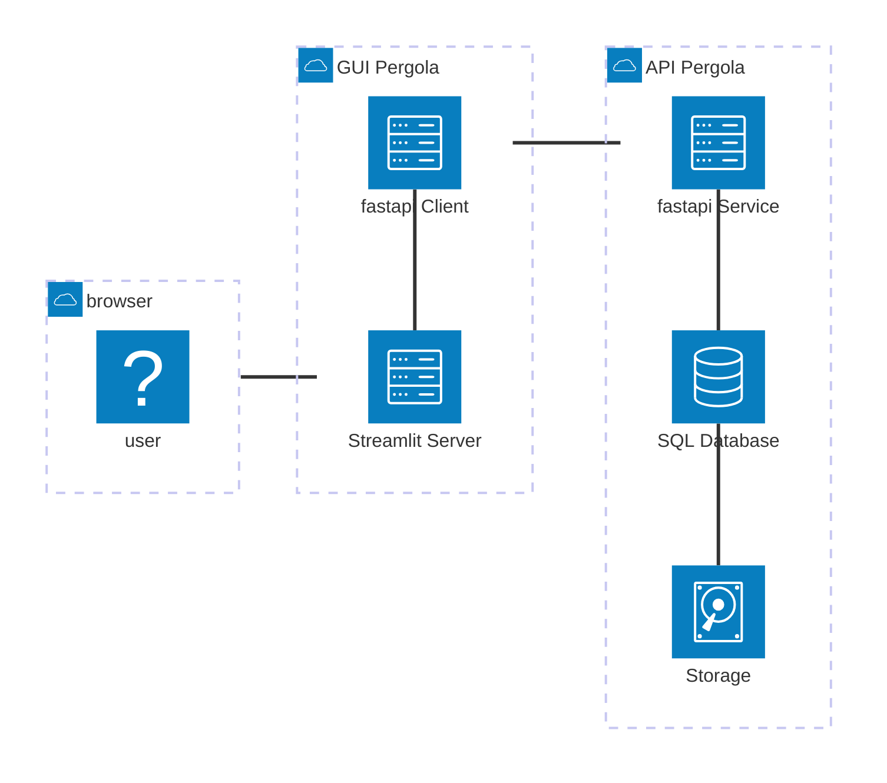

```mermaid
  info
```
# Setup of WebTools in ContiTech infrastructure

```mermaid

architecture-beta
    group api(cloud)[API Pergola]

    service db(database)[SQL Database] in api
    
    service disk2(disk)[Storage] in api
    service fastapiserver(server)[fastapi Service] in api

    db:T -- B:fastapiserver
    
    disk2:T -- B:db

    group GUI(cloud)[GUI Pergola]

    service streamlit(server)[Streamlit Server] in GUI    
    service fastapiclient(server)[fastapi Client] in GUI

    streamlit:T -- B:fastapiclient
    
    group User(cloud)[browser]

    service browser(logos:terminal)[user] in User

browser{group}:R -- L:streamlit{group}
        
fastapiclient{group}:R -- L:fastapiserver{group}
    


```